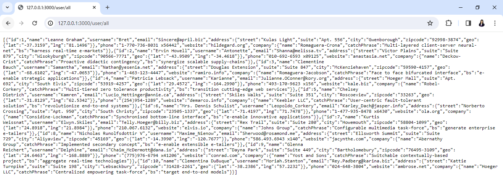
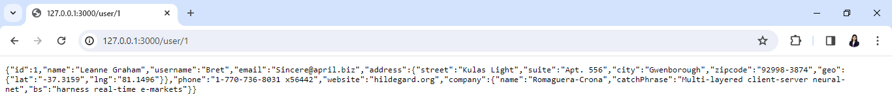

# Lab Title:
Creating our First API in Node.js without using Express.js

# Objective:
The objective of this lab is to learn how to create our first API in Node.js

# Instructions:
1. Setting Up:
   1. Clone this repository.
   2. Move inside the lab-building-first-api directory.

2. Creating and Running our First Web Server:
   1. Refer to the lab-first-web-server directory.

3. Creating our First API:
   1. There is a file named userApi.json which contains user details in JSON format.
   2. Create a JavaScript file (e.g., userData.js).
   3. Create the following Routes:
      1. If the request method is 'GET' and the URL is '/user/all', it responds with all the user details in JSON format.
      
      2. If the request method is 'GET' and the URL is '/user/{id}' (e.g., "/user/1", "/user/2"), it responds with the corresponding user details in JSON format.
      