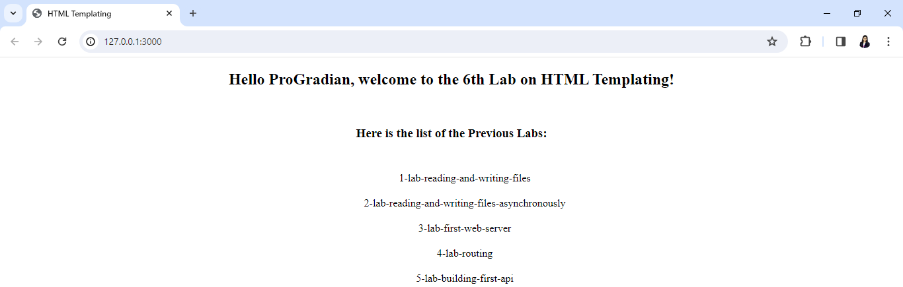

# Lab Title:
Creating our First HTML Template in Node.js

# Objective:
The objective of this lab is to learn how to create our first HTML Template in Node.js

# Instructions:
1. Setting Up:
   1. Clone this repository.
   2. Move inside the lab-html-templating directory.

2. Creating our First HTML Template:
   1. There are two files already present inside the directory.
      1. index.html contains the structure with two placeholders as {{name}} and {{lab}}.
      2. index.js contains the boilerplate code.
   2. The code should be written in a way that the output is as shown below:
      
      